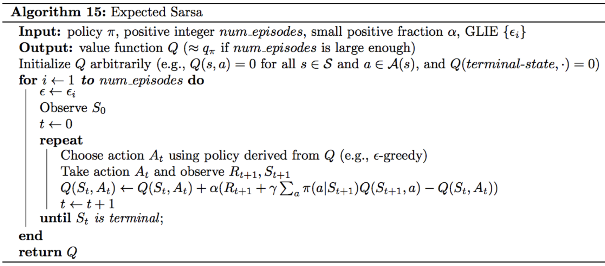

# open_ai_taxi
open ai's Taxi-v3 toy problem based on the paper, ["Hierarchical Reinforcement Learning with the MAXQ Value Function Decomposition"](https://arxiv.org/pdf/cs/9905014.pdf) by Thomas G. Dietterich. Using hierarchical reinforcement learning to find optimal strategies to pick up a passenger, get them to a location, and drop them off.

## Best score results
the score results below have been normalized by running 5 trials of 20,000 episodes a piece:

| Env        | Q Learning     | Expecated Sarsa  |  Sarsa
| ---------- |:-------------: | -----:| -----:|
| Taxi-V3    | 8.55           | 7.62  | 7.44  |

## Learning Rate by algorithm
 

## Sarsa
| Learning Rate             |  Reward by Trial |
:-------------------------:|:-------------------------:
  |  

### Sarsa Algorithm Pseudocode

 

The below equation from the pseudocode is the heart of the algorithm. It is used as the error function used to update the reward weights in the Q table:

**Q(St, At) = Q(St, At) + α(Rt+1 + γQ(St+1, At+1)) - Q(St, At))**

we take the difference of the following two parts, and add it to the current rewward value for the current state action pair:
1. alternative estimate: α(Rt+1 + γQ(St+1, At+1))
2. current estimate: Q(St, At))

part 1, uses the following parameters to update the current state action pair's reward value:
| Parameter             |  Meaning |
:-------------------------:|:-------------------------:
| Rt+1                   | This is the reward for the next timestep
|         γ                         | gamma is the discount rate. It quantifies how much to weight future reward
|         α                         | alpha is the learning rate
|Q(St+1, At+1)| is the Q table value for the next state action pair

part 2, is the current Q table reward value for the current state value pair. Finding the difference between part 1 and part 2 and adding it to the Q table value for the current state action pair provides an incremental increase in accuracy of the algorithm as the number of episodes increase. 

## Q Learning
| Learning Rate             |  Reward by Trial |
:-------------------------:|:-------------------------:
  |  

### Q Learning Algorithm Pseudocode

 

The first difference between Sarsa and Q learning algorithmically lies in the alternate function:

**α(Rt+1 + γmaxaQ(St+1, a))**

By taking the max value where at ∈ a (i.e. the max value for the next state in the set of all actions) the reward value update that will be applied to the current Q table reward value will be maximized based off of the next state over all actions. 

Next we hit largest fundamental difference between Q learning and sarsa: **Despite the best possible greedy update to the Q table for the current state action pair being made, the algorithm will use a probability to choose whether it will use the greedy maximization provided above, or randomly pick another state for the next action.** This is called off policy learning, and it is the balance between exploiting and exploring the state action space of the current world. 

## Expected Sarsa
| Learning Rate             |  Reward by Trial |
:-------------------------:|:-------------------------:
  |  

### Expected Sarsa Algorithm Pseudocode

 

Finally the expected Sarsa algorithm uses the expected value of the next state action pair where the expectation takes into account the probability that the agent selects each possible action from the next state:

**Σa(π(a | St+1)Q(St+1, a)) - Q(St, At)**

in the alternative steap above π represents the policy. π(a | St+1) means for all actiosn of the next state. Expected Sarsa is on policy because it exploits knowledge about stochasticity in the behavior policy to perform updates with lower variance. Whatt does this mean? it uses the  probability shown in the alternative function shown above to more effectively  exploit the state action space and thus decreasing the variance experienced in the outcome. You can see in the Reward by Trial chart for the expected sarsa algorithm that it experiences less variance than the other algorithms.

## On Policy / Off Policy what's the difference? why does it matter?
The most thorough explanation I have been able to for the pros and cons of each are exhibited in this exerpt from [A Theoretical and Empirical Analysis of Expected Sarsa](http://citeseerx.ist.psu.edu/viewdoc/download?doi=10.1.1.216.4144&rep=rep1&type=pdf)

***In off-policy TD methods such as Q-learning [6], the behavior policy, used to control the agent during learning, is different from the estimation policy, whose value is being learned. The advantage of this approach is that the agent can employ an exploratory behavior policy to ensure it gathers sufficiently diverse data while still learning how to behave once exploration is no longer necessary. However, an onpolicy approach, in which the behavior and estimation policies are identical, also has important advantages. In particular, it has stronger convergence guarantees when combined with function approximation, since off-policy approaches can
diverge in that case [7], [8], [9] and it has a potential advantage over off-policy methods in its on-line performance, since the estimation policy, that is iteratively improved, is also the policy that is used to control its behavior. By annealing exploration over time, on-policy methods can discover the same policies in the limit as off-policy approaches.***

They delve a little bit deeper than necessary for this problem introducing function approximation and simmulated annhealing, but I think the explanation in the general case stands for itself. 
